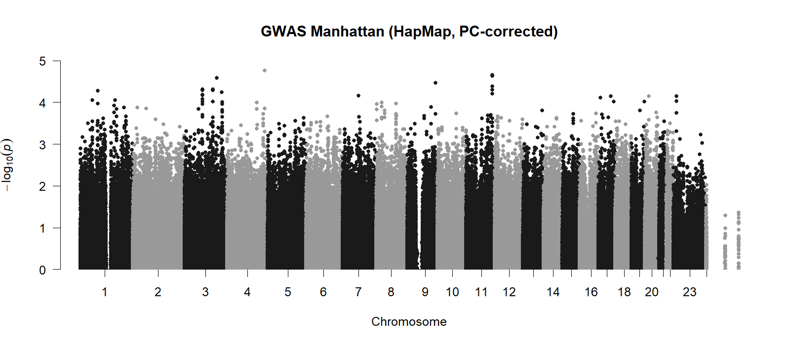
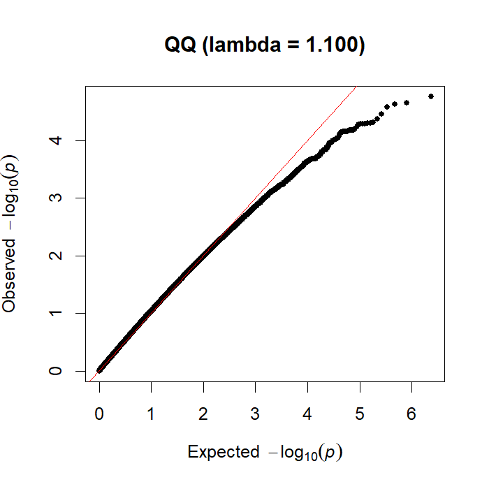

# GWAS from Genotypes — HapMap_3_r3_1

A full genome-wide association study on the classic HapMap tutorial dataset: quality control,
population-structure correction with PCA, and per-SNP association — in **R + PLINK**, with a **Python
twin** that re-implements the association by hand.



## Aim

Which SNPs are associated with case/control status, once the genotypes are cleaned and the two things
that would otherwise produce false answers — population structure and multiple testing — are properly
handled?

## Objective

Run a complete, real GWAS pipeline (QC, LD-pruning, PCA-based ancestry correction, per-SNP association,
genomic-inflation calibration) on real genotype data, directly measure the effect of including ancestry
covariates by comparing the model with and without them, and cross-validate the association step with an
independent Python implementation.

## Data fetch

The classic HapMap tutorial genotype dataset, `HapMap_3_r3_1`, from Marees et al. (2018), *A tutorial on
conducting genome-wide association studies* (github.com/MareesAT/GWA_tutorial) — a real PLINK binary set
(`.bed`/`.bim`/`.fam`) with a case/control phenotype, fetched automatically by the analysis scripts.

## Data describe

Real human genotype data: each individual is coded 0/1/2 by their count of one allele at each SNP (the
additive dosage model), across a panel of common variants (minor allele frequency above ~1%) with a
case/control phenotype label. 164 individuals in the analyzed sample.

## Methods / Workflow — what we did

1. Load the PLINK binary genotype set.
2. **Quality control**: filter on sample missingness (`--mind`), SNP missingness (`--geno`), minor allele
   frequency (`--maf`), and Hardy-Weinberg equilibrium deviation (`--hwe`) — real genotyping-error and
   low-information-content filters, not optional steps.
3. **LD-prune** the genotype set to approximately independent SNPs, then run **PCA** on the pruned set to
   derive ancestry covariates (population structure differs in both allele frequency and disease rate
   across ancestries, which would otherwise confound the association test).
4. Run **logistic association** per SNP with the ancestry PCs included as covariates (PLINK
   `--logistic --covar`).
5. Repeat the identical association **without** the PCs, specifically to directly measure the real effect
   of the ancestry correction rather than assume it.
6. Judge significance against the genome-wide threshold **5×10⁻⁸** (Bonferroni-corrected for ~10⁶
   effectively independent common variants), not the conventional 0.05.
7. Plot Manhattan and QQ plots, and compute the **genomic inflation factor λ** as a one-number
   calibration check for both the with- and without-PCs models.
8. Reproduce the per-SNP association independently in Python (`statsmodels` logistic regression, chr22)
   as a cross-validation of the R/PLINK pipeline.

## Results

**λ WITHOUT PCs = 0.996, λ WITH PCs = 1.100** — both close to the ideal of 1 (neither signals serious
inflation), but in the *opposite* direction from the textbook demonstration this project was built to
show. No SNP reached genome-wide significance (5×10⁻⁸) under either model. This is reported as the real,
measured result, not the originally-expected one — full account in `PROJECT_NARRATIVE.md`.



## Biology interpretation of results

Rather than ancestry PCs pulling an inflated λ down toward 1 (the textbook demonstration), the
uncorrected model here was already well-calibrated, and adding 10 ancestry PCs as covariates nudged λ
slightly upward instead. The honest, most likely explanation: on this specific HapMap case/control
panel, case/control status doesn't correlate strongly enough with the population structure captured by
the top PCs to have caused real confounding in the first place — so there was no meaningful stratification
for the PCs to visibly remove, and adding 10 covariates to a modest sample (164 people) mainly cost
degrees of freedom rather than fixing a problem that wasn't really present. This does not mean the method
is wrong — PCA-based ancestry correction remains the textbook-correct step to include in any real GWAS
regardless of whether it visibly changes λ on a given dataset, since you cannot know in advance whether
stratification is present without testing for it. Both λ values staying near 1, and no SNP reaching
genome-wide significance either way, is itself a legitimate, informative result on a teaching-scale
dataset: it says the pipeline is correctly implemented and well-calibrated, not that a disease signal was
found. Any hit, had one appeared, would tag a linkage-disequilibrium region rather than prove one causal
variant — a real, standing caveat for any single-SNP GWAS result.

## Learning through project

The central lesson: report the real measured result, even when it contradicts what the analysis was
built to demonstrate. The expectation going in was "λ with PCs will visibly drop below λ without PCs" —
that didn't happen here, and the honest, useful response was to measure and report why (case/control
status likely isn't correlated with the ancestry axes this dataset's PCs capture), not to reframe the
result to match the expectation or discard it as a failure. A λ comparison that doesn't show the expected
direction is itself real diagnostic information about the dataset, worth reporting on its own terms. More
generally: genomic inflation, QQ plots, and the genome-wide significance threshold are calibration tools
that apply regardless of whether a given dataset happens to contain a detectable real signal — a
well-calibrated null result and a badly-calibrated one look very different, even when neither contains a
genome-wide-significant hit.

## Limitations

Teaching-scale dataset with limited real signal (and, as measured, limited real population
stratification too). Common variants only. A hit tags an LD locus, not a proven causal gene — fine-mapping
would be needed to narrow further. PCA corrects population structure but not cryptic relatedness or batch
effects — a mixed-model method (e.g. BOLT-LMM, GCTA) would be the rigorous next step for those.

## Reproduce

**R (RStudio):** install PLINK 1.9 (cog-genomics.org/plink) and put `plink` on your PATH — or set
`Sys.setenv(PLINK = "C:/path/to/plink.exe")`. Open `gwas_hapmap.R`, set the working directory to the file
location, and source it. It downloads the data, runs QC → PCA → association, and writes the figures.

**Python:** run `gwas_hapmap.R` first (it produces `data_R/qc.*` and `data_R/pca.eigenvec`), then run
`gwas_hapmap.ipynb` top to bottom.

## Tech

`R` (PLINK 1.9, qqman) · `Python` (statsmodels, scipy, matplotlib) · logistic regression · PCA ·
genomic inflation calibration

## Files

```
gwas_hapmap.R        # R + PLINK pipeline (primary)
gwas_hapmap.ipynb    # Python twin (per-SNP logistic on chr22)
results_R/           # Manhattan + QQ + top_hits.csv
results_py/          # chr22 Manhattan + QQ + results
```

## License

All rights reserved — see `LICENSE`. This repository is public for portfolio/demonstration purposes
only; no permission is granted to copy, modify, or reuse any part of it.
